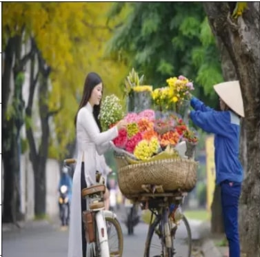

# Neural Style Transfer with PyTorch

This project implements Neural Style Transfer using PyTorch, a technique that combines the content of one image with the style of another image. The core idea is to use a pre-trained convolutional neural network to extract content and style features from input images, and then optimize a target image to minimize both the content loss and the style loss.

## Content Image

## Style Image

## Generated GIF
Here is a GIF showing the progression of generated images during the Neural Style Transfer process:

## Overview
1. **VGG Model**: Utilizes a VGG-19 model pre-trained on ImageNet to extract features from input images.
2. **Loss Functions**: Defines content loss and style loss functions to measure the difference between feature representations of the content, style, and generated images.
3. **Folder Management**: Organizes output images into folders based on timestamp.
4. **Training Loop**: Optimizes the generated image to minimize the total loss, which is a combination of content and style losses.

## How to Use
1. **Install Dependencies**: Make sure to have PyTorch, torchvision, matplotlib, and PIL installed in your environment.
2. **Prepare Images**: Choose a content image and a style image. These images should be in the "Assets" folder.
3. **Run the Code**: Execute the provided Python script for Neural Style Transfer. I found out that `2000 epochs` is best for this size.

## Files Included
- `nst_torch.py`: Main Python script containing the implementation of Neural Style Transfer.
- `Assets`: Folder containing example content and style images.
- `Gans_Torch`: Output folder where generated images and loss logs are stored.

## Results
The generated images are saved periodically during training, allowing for the observation of how the style of the output image evolves over time.

## Acknowledgments
- This project is inspired by the work of Gatys et al. in "A Neural Algorithm of Artistic Style".
- PyTorch and torchvision libraries are utilized for deep learning functionality.

Feel free to reach out with any questions or feedback!
